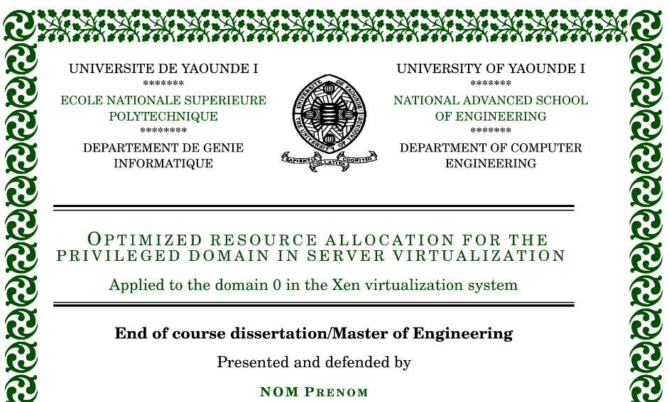

# Latex Thesis Template for ENSP
This repository contains a thesis latex project template based on the [University of Bristol](https://www.sharelatex.com/templates/thesis/university-of-bristol-thesis-template) thesis latex template. The project is best suited for ENSP students but anyone can customize it to suit his/her needs.

### Prerequisites
In order to follow the tutorial smoothly, start by installing latex on your machine and any latex editor that suits you; I use [TeXstudio](https://www.texstudio.org) latex editor. Installing and configuring these is beyond the scope of this tutorial. You can also download the zip and then upload the project to [ShareLateX](https://www.sharelatex.com) (Recommended Approach). To use this template with minimal hiccups, you should have a fairly good level of latex knowledge.


## Downloading the project to your machine 
To get this starter template on your local machine, you can either download the zip file or clone the project using git

```
git clone https://github.com/Yuhala/latex-thesis.git

```
## Uploading the project to ShareLaTeX 
If you prefer using [ShareLateX](https://www.sharelatex.com) (Recommended) for your latex projects, simply create a new latex project on [ShareLateX](https://www.sharelatex.com) and upload the downloaded zip file to your workspace. ie In ShareLaTeX: **New Project -> Upload Project -> Select a .zip file**

#### Quick intro
As a quick intro, the project contains 3 main folder: `chapters`, `frontmatter`, and `logos`. The names are pretty self explanatory. Each chapter folder has a figure folder, where all images for the chapter should be put. The `ornaments.pdf` file contains the full documentation for the `latex ornament package` which is used for all the beautiful designs. 

#### Quick test
In order to do a quick test of the project, open the folder in your latex editor and compile the project. You would probably see some errors but as long as your `memoirthesis.pdf` has reasonable enough content, I think you are good to go.

#### Doing Modifications
Here we would get a little bit into the internals of the project and learn how we can build our project using this as a base. Keep in mind that the main latex project file is the  `memoirthesis.tex` file. This file indexes all the rest and should be the first file opened in your latex editor.

## Frontmatter
The frontmatter consists of the front page, title, gloassaries, abstracts and dedications.

## Frontpage border design
To modify the frontpage border design, open the `frontmatter/title.tex` file and modify the tikzpicture values. 
```
\begin{tikzpicture}[remember picture, overlay, start chain, node distance=-2mm,color=darkgray]
\node (nworn) [shift={(5mm,-5mm)}, anchor=north west, on chain ] at (current page.north west) {\pgfornament[width=10mm]{24}};
\foreach \i in {1,...,17}
\node [on chain] {\pgfornament[width=10mm]{19}};
\node (neorn) [on chain] {\pgfornament[width=10mm]{24}};
\foreach \i in {1,...,25}
\node [continue chain=going below, on chain] {\pgfornament[width=10mm]{24}};
\node (seorn) [on chain] {\pgfornament[width=10mm]{24}};
\foreach \i in {1,...,17}
\node [continue chain=going left, on chain] {\pgfornament[width=10mm]{24}};
\node (sworn) [on chain] {\pgfornament[width=10mm]{24}};
\foreach \i in {1,...,25}
\node [continue chain=going above, on chain] {\pgfornament[width=10mm]{24}};
\end{tikzpicture}
```
The corresponding design for the above code is as follows...


The left and right border designs correspond to design `24` and the top border corresponds to design `19`. `Page 17` of the ornaments package documentation presents a list of designs and their corresponding values. See the [ornaments package documentation](ornaments.pdf) for more information.

## Default Colour
The default colour used here is green. To change the default colour open the `memoirthesis.tex`  file and modify the colour values in the below command. 

```
\definecolor{darkgray}{RGB}{0,80,0}
```
For example the colour code `{RGB}{0,0,120}` gives the following view.


## Glossaries
Glossary items are added in the `memoirthesis.tex` file using the below syntax
```
\newglossaryentry{bench}
{
	name = Benchmark,
    description = {In computer science, a benchmark is a test to measure the performance of a system to compare it to others},
    plural = benchmark
}
```
Read the [glossaries documentation](https://www.sharelatex.com/learn/Glossaries) on ShareLatex for more information

## Abstract, titles, dedications
Modifying these is as simple as ABC...change the default lipsum text and enter what you want. Compile each time and view the pdf till you are satisfied with the outcome

## Chapters
Each chapter starts with a small mini table of contents. Modify the corresponding tex file. All figures should be put in the
`figxx` directory for the sake of neatness

#### Troubleshooting
For any strange errors, [TeX-LaTeXStackExchange](https://tex.stackexchange.com/) forum is your best bet...

## Author

* **Peterson Yuhala** 


## Acknowledgments
[ShareLateX](https://www.sharelatex.com)

